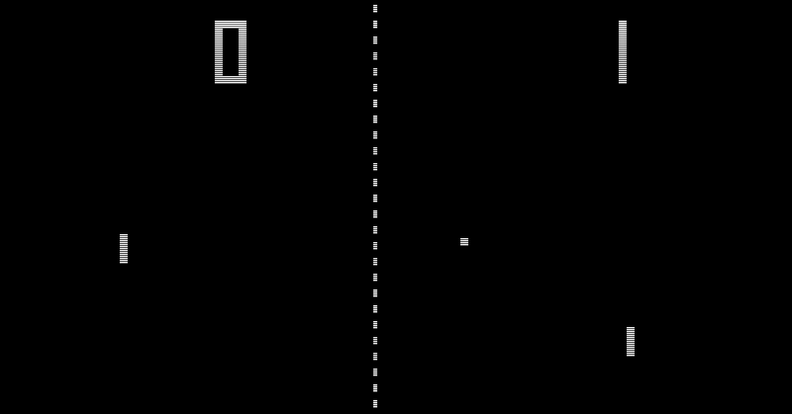

We will be making a version of the classic game "Pong".

## A. Animation

Animation fundamentals tutorial: <https://happycoding.io/tutorials/p5js/animation>

> Note: Middle click (click with the scroll wheel on the mouse) or right click and then select "Open in new tab" can be used to open links without losing this page.

1. Open up the `p5.js` code editor (<https://editor.p5js.org/>).
2. Log in, if you are not already
	- If you need to log in, click "Log In" in the top right corner.
	- On the next page, click the log in with **Google** button
1. Rename your project to "animation (\<YOUR NAME HERE\>)"
2. Save your project (File > Save, or Control+s).
	- Make sure to save every few minutes or so, so that your code doesn't get lost.

Now read and work through the animation tutorial. Raise your hand / get my attention if you have a question or want help.

### Exercises
See the "Homework" section at the bottom of the animation tutorial.

1. Complete the gravity exercise

### (optional) Cool things to try
- Leave an after-image trail of the ball: change the background call to be: `background(32, 20)`
	- The first argument (32) is the color, the second argument (20) is the transparency value, which ranges from 0 to 255.
	- Each repaint of the background covers up a little bit more of the old frames.
	- `background(32, 255)` has the same behavior as `background(32)`

## B. Pong

### 0. Starter code

```javascript
// state
let ballX
let ballY
let ballRadius = 30
let xSpeed = 5
let ySpeed = 5

let SPACEBAR = 32
let KEY_W = 87
let KEY_S = 83

function setup() {
  createCanvas(400, 400)
  
  ballX = width / 2
  ballY = height / 2 - 100
}

function draw() {
  
  stroke('white')
  fill('white')
  
  // clear out old frames
  background(32)

  // draw current frame based on state
  circle(ballX, ballY, ballRadius)

  // modify state
  ballX = ballX + xSpeed
  ballY = ballY + ySpeed
  
  // ball hits left wall
  if (ballX < 0) {
    // bounce off
    xSpeed = xSpeed * -1
  }
  
  // ball hits right wall
  if (ballX > width) {
    // bounce off
    xSpeed = xSpeed * -1
  }

  // bounce off top and bottom
  if (ballY < 0 || ballY > height) {
    ySpeed = ySpeed * -1
  }
}

// https://github.com/bmoren/p5.collide2D/blob/master/p5.collide2d.js
function collideRectCircle(rx, ry, rw, rh, cx, cy, radius) {
  //2d
  // temporary variables to set edges for testing
  var testX = cx
  var testY = cy

  // which edge is closest?
  if (cx < rx) {
    testX = rx // left edge
  } else if (cx > rx + rw) {
    testX = rx + rw
  } // right edge

  if (cy < ry) {
    testY = ry // top edge
  } else if (cy > ry + rh) {
    testY = ry + rh
  } // bottom edge

  // get distance from closest edges
  var distance = this.dist(cx, cy, testX, testY)

  // if the distance is less than the radius, collision!
  if (distance <= radius) {
    return true
  }
  return false
}
```

### 1. Paddle
#### Task: Add paddle to the game

State (variables):
- position
	- [ ] Define variable: `paddleX`
	- [ ] Define variable: `paddleY`
- size
	- [ ] Define variable: `paddleWidth`
	- [ ] Define variable: `paddleHeight`
- [ ] Define variable: `paddlespeed`
- [ ] Initialize all these variables

Visual:
- [ ] draw a rectangle using the paddle variables and the [rect()](https://p5js.org/reference/p5/rect) `p5.js` function

### 2. Keyboard input

Available keys:
- `SPACEBAR`
- `KEY_W`
- `KEY_S`
- `UP_ARROW`
- `DOWN_ARROW`
- `LEFT_ARROW`
  `RIGHT_ARROW`

> Note: If you want to use additional keys, let me know and I'll show you how.

#### Checking if a key is pressed

We use the [keyIsDown()](https://p5js.org/reference/p5/keyIsDown/) function from `p5.js`. It takes one argument/parameter, which is a "key code". An example key code is 32, which means spacebar. This would be ridiculous to remember, so there are some (all-caps) variables already available to you for certain keys.

Example:
```javascript
if (keyIsDown(KEY_W)) {
  // ...
}
```

Checking for keyboard input needs to go in the `draw()` function.

#### Task: Move paddle with keyboard input

- [ ] Paddle up
	- Write an if statement to check if the 'w' key is pressed.
	- When the 'w' key is pressed, move the paddle upwards.
	- Note: Remember we have the `paddleSpeed` variable.
	- **Hint:** You saw how to move a game object by updating its state in the [animation tutorial](https://happycoding.io/tutorials/p5js/animation).
- [ ] Paddle down
	- Write an if statement to check if the 's' key is pressed.
	- When the 's' key is pressed, move the paddle downwards.

### 3. Collision detection

I've provided a function in the starter code called `collideRectCircle()`. It returns true or false (so we can use in the condition of an if statement) based on whether a rectangle and a circle are colliding (touching).

Template: `collideRectCircle(rectX, rectY, rectWidth, rectHeight, circleX, circleY, circleRadius)`

#### Task: Detect collisions between paddle and ball

- [ ] Write an if statement to check if the paddle is colliding with the ball
- [ ] In that if statement, bounce the ball
	- **Hint:** Which way/how should we bounce it? Look at the different ways we bounce depending on which wall the ball touched. Which way should we use for the paddle?

### 4. Displaying score

State (variables):
- [ ] Define variable: `score`, initialize it to zero

Visual:

```javascript
textSize(25)
text(score, 30, 30)
```

The `text()` function template is: `text(message, x, y)`.

The text function allows us to draw text on screen. In this case, the text is a number, the current score value.

### 5. Tracking score

#### Task: Track score

- [ ] When the ball hits the left wall, decrease the score by 1
	- Eventually you can change this to increase the opponent's score by 1, if you complete the two-player version.

### Exercises

- Draw a line down the middle of the screen, to visually divide the sides.
	- Use the `p5.js` [line()](https://p5js.org/reference/p5/line/) function.
	- Hint: While you can always look at the size of the canvas in `createCanvas()` and calculate the middle by hand, the variables `height` and `width` contain the canvas dimensions, so you can use those to calculate the middle regardless of how big the canvas is.
	- Hint: Division can be done with `/` (forward slash). Example: `10 / 5` means "10 divided by 5".
- Add a second paddle and second score counter to make it a two-player game.
- Or do single player:
	- Increase the score by 1 when the ball collides with the paddle
- Make the game harder over time. Ideas:
	- Make the ball speed get faster as the score gets larger
	- Make the paddle smaller as the score gets larger